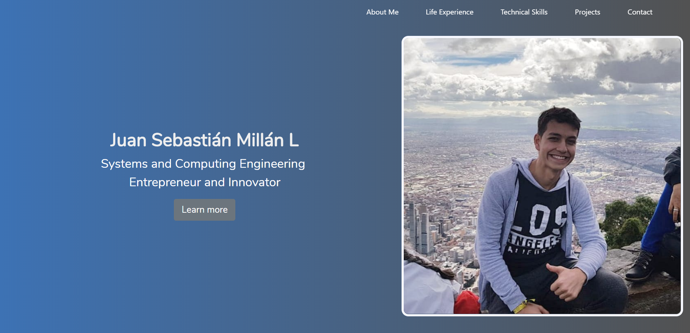

# Juan Sebastián Millán Lejarde Personal Web Page

### Description:

Here you cand find the repository of my personal web page. This is the first project of the Web Development course in Universidad de los Andes, Bogotá Colombia. 

### Objectives:

The principal objective of the creation of this project is to improve my skills using web development languages and also share my first personal web page that has interesting information about myself and my projects.

### Develop using:

* HTML5
* CSS3
* Bootstrap
* JavaScript
* jQuery

### How to run the project

For running the project you just have to go to the following URL: https://jsmillan10.github.io/SebasWebPage/ , or you can clone the project and deploy it locally using the http-server tool.

### Author

Juan Sebastián Millán Lejarde - 201516818 - js.millan10

### Screenshot

### MIT License

This project is licensed under the MIT License - see the LICENSE.md file for details
